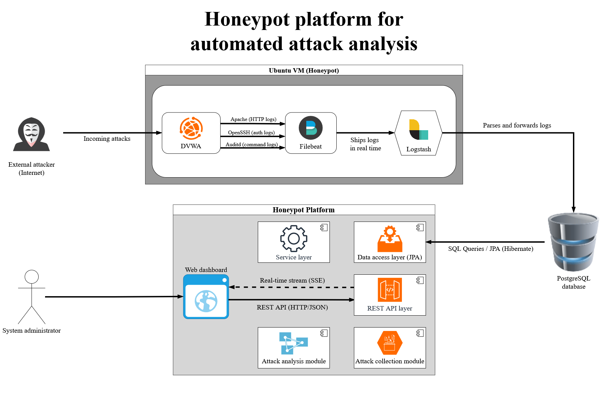

# Honeypot-Platform-for-Automated-Attack-Analysis

A hybrid honeypot with dynamic operational behavior, featuring a fully automated deployment pipeline and real-time attack analysis. The platform captures, stores, and analyzes attacks in real time, combining a low-interaction honeypot running on an Ubuntu VM with a web dashboard built in Spring Boot and React.

The honeypot is low-interaction but changes its behavior corresponding to the operational mode — research or production.

---

## Project Structure

```
Honeypot-Platform-for-Automated-Attack-Analysis/
├── backend/        ← Spring Boot REST API (Java 21)
├── frontend/       ← React web dashboard
├── setup.sh        ← Automated honeypot setup script
├── setup.md        ← Manual setup and configuration guide
├── .env.example    ← Environment variable template
└── README.md
```

---

## Architecture

<p align="center">
  
</p>

### Part 1 — Honeypot (Ubuntu VM)

The honeypot runs on an Ubuntu virtual machine. It exposes an Apache web server and an SSH service, capturing attacks through system logs which are shipped in real time to an external PostgreSQL database.

### Attack Capture Workflow

```
External Attacker (Internet)
   │
   ▼
Vulnerable Application (Apache / OpenSSH)
   │
   ├── Apache (HTTP logs)        → /var/log/apache2/access.log
   ├── ModSecurity (payloads)    → /var/log/apache2/modsec_audit.log
   ├── OpenSSH (auth logs)       → /var/log/auth.log
   └── Auditd + Rsyslog          → /var/log/audit/audit.log
   │
   ▼
Filebeat (ships logs in real time)
   │
   ▼
Logstash (parses and forwards logs)
   │
   ├── access.log      → INSERT INTO attacks (timestamp, attacker_ip, http_method, endpoint, status_code, user_agent, raw_log)
   ├── modsec_audit.log → UPDATE attacks SET payload WHERE attacker_ip, endpoint, timestamp
   ├── auth.log        → INSERT INTO auth_logs (timestamp, username, source_ip, status, raw_log)
   └── audit.log       → INSERT INTO command_logs (timestamp, command, raw_log)
   │
   ▼
PostgreSQL (external database)
```

**Components:**
- **Apache HTTP Server** — generates web access logs from the vulnerable app
- **OpenSSH** — captures login attempts and brute force attacks
- **Auditd** — tracks all commands executed on the system
- **Filebeat** — ships logs in real time to Logstash
- **Logstash** — parses logs and forwards them to PostgreSQL
- **ModSecurity** — Web Application Firewall that captures full HTTP request bodies (payloads)
- **PostgreSQL** — external database storing all captured attack data

**Data captured:**

| Table | Description |
|---|---|
| `attacks` | HTTP requests to the Apache web server, including request payloads (POST bodies) |
| `auth_logs` | SSH login attempts (FAILED, INVALID_USER, SUCCESS, DISCONNECTED) |
| `command_logs` | Commands executed on the system (sudo and regular user commands) |

### Part 2 — Web Dashboard

A web application for visualizing and analyzing the captured attack data in real time.

## Attack Monitoring Workflow

```
System Administrator
   │
   ▼
Web Dashboard (React)
   │                        ▲
   │ REST API (HTTP/JSON)   │ SSE (real-time events)
   ▼                        │
REST API Layer (Spring Boot)
   │
   ▼
Service Layer
   │
   ▼
Data Access Layer (JPA / Hibernate)
   │
   ▼
PostgreSQL (external database)
```

**Tech stack:**
- **Backend:** Java 21 + Spring Boot 3.5.13
- **Frontend:** React
- **Database:** PostgreSQL
- **Architecture:** REST + JPA

**Backend features:**
- REST API endpoints for all three log tables (`/attacks`, `/auth-logs`, `/command-logs`)
- Pagination and sorting on all endpoints
- Partial search and filtering using native SQL `LIKE` queries
- Real-time push notifications via SSE (Server-Sent Events) and PostgreSQL `LISTEN/NOTIFY`
- Global CORS configuration for React frontend


**Frontend features:**
- Real-time dashboard that updates automatically when new attacks are detected
- Separate pages for Attacks, Auth Logs and Command Logs
- Live search with partial matching across all fields
- Pagination with page reset on filter change
- Formatted timestamps
- View Details popup showing raw log and request payload (closeable with Escape key)

---

## Prerequisites

- Ubuntu VM (honeypot machine)
- Kali VM (optional, for simulating attacks)
- Windows/Linux machine running PostgreSQL
- Java 21 + Maven (for the backend)
- Node.js (for the frontend)

---

## Automated Setup Script

The project includes a fully automated setup script that provisions the entire honeypot environment on a fresh Ubuntu virtual machine.

The script installs and configures all required components:

- Apache HTTP Server
- DVWA (Damn Vulnerable Web Application)
- OpenSSH (with verbose logging enabled)
- Auditd (with command tracking rules)
- Filebeat (real-time log shipping)
- Logstash (log parsing and database ingestion)
- Rsyslog (bash command logging via PROMPT_COMMAND)
- ModSecurity (Apache WAF for capturing request payloads)
- PostgreSQL JDBC driver

It also applies several security and resilience measures:

- Loads database credentials securely from a `.env` file
- Configures Logstash to use environment variables (no hardcoded secrets)
- Enables automatic service restart (`Restart=always`)
- Prevents manual stopping of critical services (`RefuseManualStop=yes`)
- Locks Auditd rules to prevent tampering (`-e 2`)
- Makes the Logstash pipeline and Filebeat configurations immutable (`chattr +i`)

### Usage

```bash
cp .env.example .env
nano .env
chmod +x setup.sh
sudo ./setup.sh
```

---

## Manual Setup

### Honeypot Setup

See [setup.md](setup.md) for the full step-by-step guide to setting up the honeypot on the Ubuntu VM, including Apache, DVWA, ModSecurity, Filebeat, Logstash, Auditd, OpenSSH, and PostgreSQL configuration.

### Backend Setup

1. Navigate to the `backend/` folder and open it in IntelliJ IDEA.
2. Copy `.env.example` to `.env` and fill in your database credentials.
3. Add the environment variables to your IntelliJ run configuration.
4. Run `BackendApplication.java`.

The backend will start on `http://localhost:8080`.

### Frontend Setup

1. Navigate to the `frontend/` folder.
2. Install dependencies:
```bash
npm install
```
3. Start the development server:
```bash
npm start
```

The frontend will start on `http://localhost:3000`. Make sure the backend is running first.

---

## Environment Variables

Copy `.env.example` to `.env` and fill in your values:

```
DB_HOST=your_host
DB_PORT=5432
DB_NAME=your_db_name
DB_USER=your_db_user
DB_PASSWORD=your_db_password
```

---

## Security

- Database credentials are stored in `.env` and never hardcoded
- Logstash, Filebeat, and Auditd are configured to restart automatically and refuse manual stops
- Audit rules are locked with `-e 2` — cannot be modified without a reboot
- The Logstash and Filebeat config files (including the `.env` credentials file) are made immutable with `chattr +i`
- Logs are shipped to the external database in real time, making it extremely difficult for an attacker to cover their tracks even with root access

---

## TODO

- [ ] Add attack analysis and pattern detection